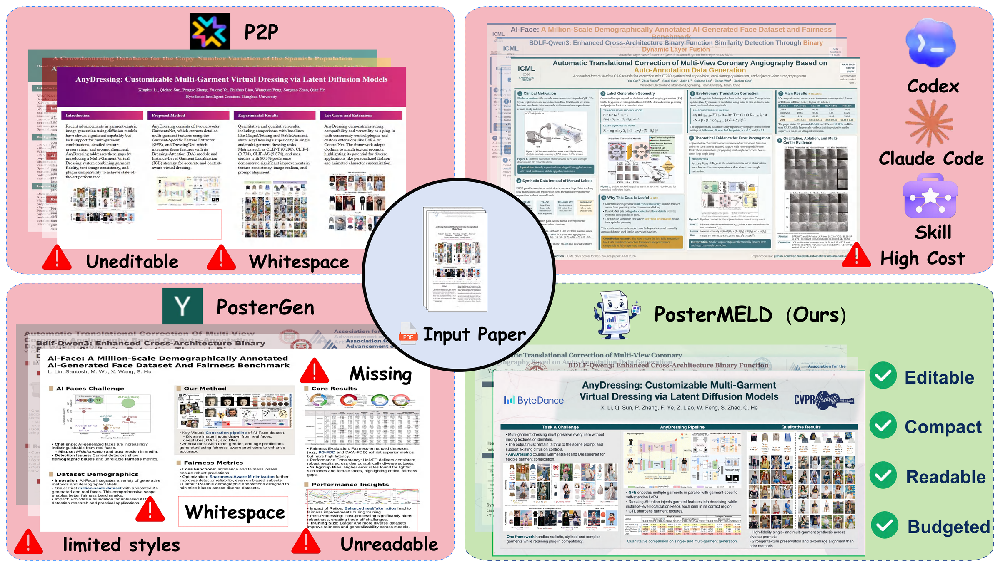
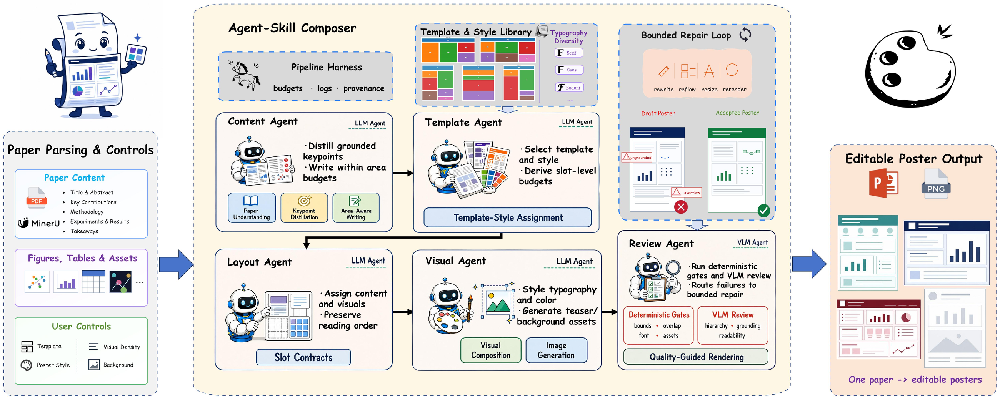
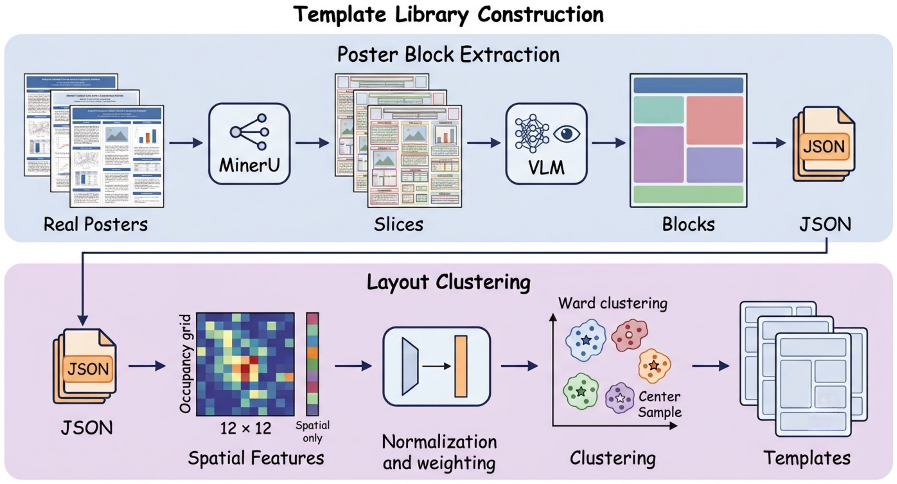
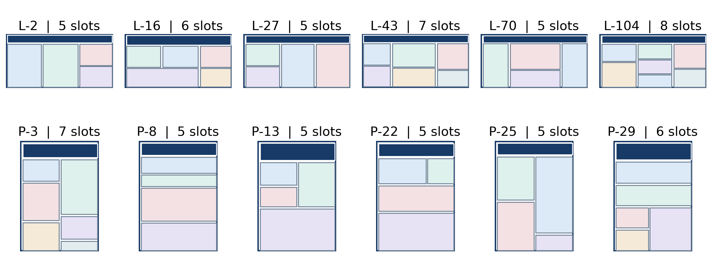
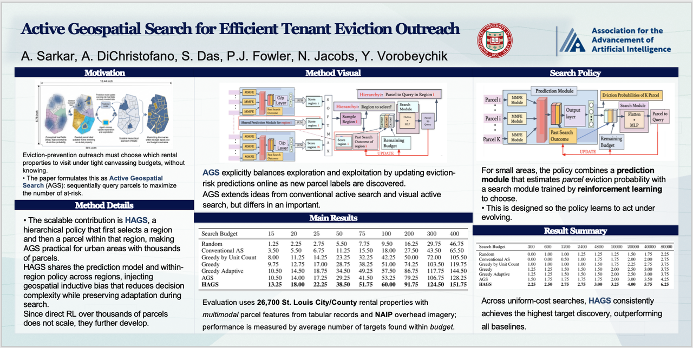
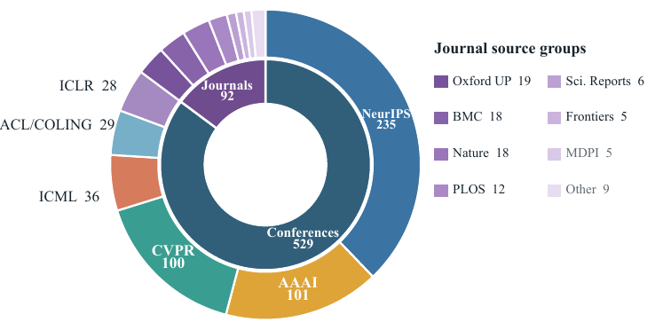

<div align="center">
  

  <h1>PosterMELD</h1>

  <p><strong>Multi-Agent Paper-to-Poster Generation for Controllable Design Diversity<br />with Editable Print-Ready Outputs</strong></p>

  <p>
    <strong>M</strong>ulti-Agent ·
    <strong>E</strong>ditable ·
    <strong>L</strong>ayouts ·
    <strong>D</strong>esign diversity
  </p>

  <p>
    <a href="https://jackey0903.github.io/PosterMELD/"><strong>Project Page</strong></a>
    · <a href="poster_generation/"><strong>Poster Generation</strong></a>
    · <a href="benchmark_eval/"><strong>Benchmark Evaluation</strong></a>
    · <a href="#quick-start"><strong>Quick Start</strong></a>
  </p>

  <p>
    
    
    
    
    <a href="LICENSE"></a>
  </p>
</div>

<p align="center">
  
</p>

PosterMELD converts scientific papers into **native, editable PowerPoint posters** and matching PNG renders. It plans template capacity before writing, grounds every section in the source paper, composes figures and tables as editable assets, and applies bounded deterministic and VLM quality checks.

## Repository Modules

The repository is organized as two independently runnable modules:

| Module | Purpose | Entry point |
|---|---|---|
| [`poster_generation/`](poster_generation/) | End-to-end PDF-to-PPTX/PNG generation pipeline, including prompts, templates, assets, configuration, scripts, and regression tests | `python -m src.workflow.pipeline` or `postermeld` |
| [`benchmark_eval/`](benchmark_eval/) | Standalone PRR/CHE, Universal Score, and Keypoint BERTScore evaluation code | `python -m prr_che.evaluate`, `python -m universal_score.evaluate`, and `python -m keypoint_bertscore.*` |

README and paper figures are kept in [`docs/readme/`](docs/readme/), while the full interactive presentation is available on the [project page](https://jackey0903.github.io/PosterMELD/).

## Highlights

- **Multi-agent composition:** specialized agents coordinate paper understanding, capacity-aware writing, layout, visual placement, and review through one traceable state.
- **Editable outputs:** text, figures, tables, section bars, and logos remain native PowerPoint elements.
- **Design diversity:** 16 landscape and 8 portrait templates support controllable style, density, background, header, and seed variations.
- **Paper-grounded content:** MinerU extracts text and visual assets; Marker is retained as an automatic fallback.
- **Bounded quality repair:** deterministic geometry checks and VLM review target only failed aspects instead of repeatedly rebuilding the poster.
- **Reproducible evaluation:** request-level PRR, conditional CHE, Universal Score, and Keypoint BERTScore are provided as a separate package.

### Results at a glance

| Method | PRR (%) ↑ | CHE ↑ | Universal ↑ | Editable | Cost / request ↓ |
|---|---:|---:|---:|:---:|---:|
| GPT-Image-2 | **85.2** | 2.698 | **4.948** | No | **$0.18** |
| Codex+Skill | 82.8 | 2.716 | 4.876 | Yes | $10.78 |
| Paper2Poster | 0.2 | - | 2.772 | Yes | $0.34 |
| P2P | 24.2 | 3.071 | 4.033 | No | $0.35 |
| PosterGen | 15.8 | 3.163 | 3.901 | Yes | $0.28 |
| **PosterMELD** | **81.3** | **3.247** | **4.456** | **Yes** | **$0.38** |
| Human reference | 98.7 | 3.287 | 4.995 | Yes | - |

PRR is computed over all requests. CHE is conditional on print-ready outputs, while Universal Score keeps missing generations in the full-benchmark aggregate.

## Method

<p align="center">
  
</p>

The generator follows a structure-first pipeline:

1. Parse the PDF into grounded text, figures, tables, formulas, and metadata.
2. Select a template and expose slot geometry, reading order, and capacity budgets.
3. Distill poster keypoints and compose sections within those budgets.
4. Place visuals, render an editable PPTX, and produce a consistent PNG preview.
5. Apply local and global quality checks, followed by bounded repair when needed.

## Templates and Design Diversity

<p align="center">
  
</p>

PosterMELD converts real poster structures into reusable layout contracts, then adapts block capacity, visual allocation, typography, and background treatment to the input paper.

<p align="center">
  
</p>

The same paper can produce materially different, valid poster designs while preserving content grounding and editability:

<p align="center">
  
  
</p>

<p align="center">
  
  
</p>

## Quick Start

### Generate a poster

```bash
git clone https://github.com/Shannon4Science/PosterMELD.git
cd PosterMELD/poster_generation

python -m venv .venv
source .venv/bin/activate
pip install -r requirements.txt
pip install -e . --no-deps
cp .env.example .env

postermeld data/0409_demo/paper.pdf \
  --layout-template auto \
  --disable-generated-teaser \
  --disable-generated-background
```

Enable the complete visual pipeline after configuring the VLM, image-generation, and MinerU endpoints in `.env`:

```bash
postermeld /path/to/paper.pdf \
  --layout-template auto \
  --poster-style navy_serif \
  --visual-density rich \
  --enable-generated-teaser \
  --enable-generated-background \
  --enable-vlm-layout-review \
  --enable-visual-legibility-review
```

See the [generation guide](poster_generation/README.md) for all controls, output files, templates, and backend configuration.

### Evaluate generated posters

```bash
cd ../benchmark_eval
python -m venv .venv
source .venv/bin/activate
pip install -r requirements.txt
cp .env.example .env

python -m prr_che.evaluate \
  --manifest examples/manifest.jsonl \
  --output-dir outputs/prr_che \
  --model gpt-5.5
```

See the [evaluation guide](benchmark_eval/README.md) for manifest schemas, aggregation rules, GPU evaluation, and reproducibility details.

## Benchmark

<p align="center">
  
</p>

PosterMELD was evaluated end-to-end on 621 papers across 14 publication-source groups and 10 research domains. The evaluation module preserves missing generations in request-level denominators and separates print readiness from conditional visual quality.

| Metric | Scope |
|---|---|
| **PRR** | Binary request-level print readiness |
| **CHE** | Craftsmanship, Harmony, and Expressiveness for print-ready outputs |
| **Universal Score** | Ten reference-aware poster criteria with missing outputs scored as zero |
| **Keypoint BERTScore** | OCR-based content coverage against ordered paper keypoints |

<p align="center">
  
</p>

## Project Layout

```text
PosterMELD/
├── poster_generation/        complete generation subproject
│   ├── assets/               conference and bundled visual assets
│   ├── config/               prompts and pipeline configuration
│   ├── data/                 runnable example papers
│   ├── scripts/              batch-generation utilities
│   ├── src/                  agents, layout, tools, state, and workflow
│   ├── templates/            16 landscape + 8 portrait templates
│   ├── tests/                generation regression tests
│   └── requirements.txt
├── benchmark_eval/           standalone benchmark-evaluation subproject
│   ├── common/               manifest, API, image, and JSON utilities
│   ├── prr_che/              print-ready and conditional aesthetic metrics
│   ├── universal_score/      reference-aware universal evaluation
│   ├── keypoint_bertscore/   OCR and content-coverage evaluation
│   ├── examples/             manifest and annotation examples
│   └── tests/                offline evaluation tests
├── docs/readme/              README visuals and paper figures
├── Makefile                  repository-level validation commands
└── LICENSE
```

## Validation

Run both offline validation suites from the repository root:

```bash
make test
```

Or validate each module independently:

```bash
make test-generation
make test-evaluation
```

## License

PosterMELD is released under the [MIT License](LICENSE).

<div align="center">
  <br />
  <strong>One paper, many valid posters.</strong>
</div>
